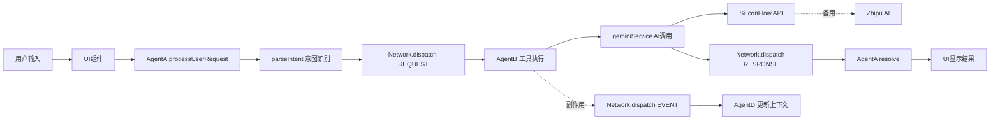

# 东里村智能导游系统 - 项目结构文档

本文档提供项目的完整结构说明和架构概览。

---

## 📂 项目目录结构

```
东里村智能导游系统 (village-guide-ai-system)
│
├── 📁 docs/                          # 📚 完整文档中心
│   ├── README.md                     # 文档导航和快速开始
│   ├── ANP_PROTOCOL.md               # ANP协议完整规范
│   ├── ANP_SEQUENCE_DIAGRAMS.md      # 通信时序图集
│   └── ANP_USAGE_GUIDE.md            # 使用指南和最佳实践
│
├── 📁 components/                    # ⚛️ React组件
│   ├── 🎭 核心功能组件
│   │   ├── WelcomeModal.tsx          # 欢迎引导页 (对话气泡+视频头像)
│   │   ├── TourGuide.tsx             # 主导游界面
│   │   ├── Login.tsx                 # 登录页面
│   │   ├── AgentPresenter.tsx        # AI代理展示器 ⭐
│   │   ├── BottomChatWidget.tsx      # 底部聊天组件 ⭐
│   │   ├── FloatingAgentBar.tsx      # 浮动代理栏
│   │   ├── VoiceInteractionPanel.tsx # 语音交互面板 ⭐
│   │   └── ANPMonitor.tsx            # ANP监控面板 🆕
│   │
│   ├── 📄 内容展示组件
│   │   ├── CelebritySection.tsx      # 名人堂板块
│   │   ├── LocalSpecialsSection.tsx  # 风物志板块
│   │   ├── RouteListDetail.tsx       # 路线详情
│   │   ├── SpotList.tsx              # 景点列表
│   │   ├── SpotDetail.tsx            # 景点详情
│   │   ├── ArticleDetail.tsx         # 文章详情
│   │   └── MapView.tsx               # 地图视图
│   │
│   ├── 📁 common/                    # 公共组件
│   │   ├── Icon.tsx                  # 图标组件
│   │   ├── Spinner.tsx               # 加载动画
│   │   ├── BottomSheet.tsx           # 底部弹窗
│   │   ├── ContentTemplates.tsx      # 内容模板
│   │   └── ModuleTitle.tsx           # 模块标题
│   │
│   ├── 📁 home/                      # 首页模块
│   │   ├── HomeView.tsx
│   │   ├── RoutesModule.tsx
│   │   └── LocalSpecialsModule.tsx
│   │
│   └── 📁 blocks/                    # 区块组件
│       ├── BlockRenderer.tsx
│       └── blockTypes.ts
│
├── 📁 services/                      # 🔧 服务层 (核心架构)
│   ├── agentSystem.ts                # ⭐ ANP核心实现
│   ├── geminiService.ts              # ⭐ AI服务封装
│   ├── googleSheetSync.ts            # Google表格同步
│   ├── offlineDb.ts                  # 离线数据库
│   ├── staticData.ts                 # 静态数据
│   └── config.ts                     # 服务配置
│
├── 📁 utils/                         # 🛠️ 工具函数
│   ├── constants.ts                  # 常量定义
│   ├── navigation.ts                 # 导航工具 (高德地图)
│   ├── audioUtils.ts                 # 音频工具
│   └── imageProcessor.ts             # 图片处理
│
├── 📁 hooks/                         # 🎣 自定义Hooks
│   └── useGeolocation.ts             # 地理定位Hook
│
├── 📁 config/                        # ⚙️ 配置文件
│   └── pageConfigs.ts                # 页面配置
│
├── 📁 src/                           # 资源目录
│   └── styles/
│       └── gif.mp4                   # 头像视频资源
│
├── 📁 uploud/                        # 🎨 静态HTML原型
│   └── fresh-start/
│       ├── casual-chat.html
│       ├── gentle-introduction.html
│       ├── optimized-design.html
│       └── welcome.html
│
├── 📄 核心配置文件
│   ├── App.tsx                       # 主应用组件
│   ├── index.tsx                     # React入口
│   ├── types.ts                      # 全局类型定义 ⭐
│   ├── index.css                     # 全局样式
│   ├── package.json                  # 项目依赖
│   ├── tsconfig.json                 # TypeScript配置
│   ├── vite.config.ts                # Vite构建配置
│   └── tailwind.config.js            # Tailwind CSS配置
│
└── 📄 项目文档
    ├── README.md                     # 项目说明
    ├── PROJECT_STRUCTURE.md          # 本文档
    └── .env.example                  # 环境变量示例
```

---

## 🏗️ 架构分层

### 1. 用户交互层 (UI Components)

```
用户 ←→ React组件 (WelcomeModal, AgentPresenter, BottomChatWidget)
```

**职责**:
- 接收用户输入
- 显示AI响应
- 管理UI状态

**关键文件**:
- `components/BottomChatWidget.tsx` - 底部聊天
- `components/AgentPresenter.tsx` - 完整AI交互
- `components/VoiceInteractionPanel.tsx` - 语音交互

### 2. 代理协调层 (ANP Network)

```
UI ←→ AgentA (门面) ←→ ANP Network ←→ AgentB (工具执行器)
                                   ←→ AgentD (数据池)
```

**职责**:
- 意图识别和路由
- 工具调用和执行
- 上下文管理

**关键文件**:
- `services/agentSystem.ts` - ANP核心实现 ⭐⭐⭐

### 3. 服务层 (AI Services)

```
AgentB ←→ geminiService ←→ AI API (SiliconFlow / Zhipu / MiniMax)
```

**职责**:
- AI API封装
- 错误处理和降级
- 结果格式化

**关键文件**:
- `services/geminiService.ts` - AI服务封装 ⭐⭐⭐
- `services/config.ts` - API配置

### 4. 数据层 (Data & Storage)

```
Services ←→ staticData / offlineDb / googleSheetSync
```

**职责**:
- 景点数据管理
- 离线缓存
- 云端同步

---

## 🔑 核心文件说明

### services/agentSystem.ts (ANP核心)

**代码行数**: ~300行  
**复杂度**: ⭐⭐⭐⭐⭐

**核心类和函数**:

```typescript
// 1. AgentNetwork 类 - 消息总线
class AgentNetwork {
  register(agentId, handler)     // 注册代理
  dispatch(msg)                  // 分发消息
  monitor(msg)                   // 监控消息
  getContext()                   // 获取上下文
  getMessageHistory()            // 获取历史
}

// 2. Agent B - 工具执行器
Network.register('B', async (msg) => {
  // 监听REQUEST消息
  // 调用工具函数
  // 发送RESPONSE消息
});

// 3. Agent A - 门面代理
export const AgentA = {
  processUserRequest(text, context, mode)  // 主要API
  getSystemStatus()                        // 系统状态
  getAgentHealth()                         // 代理健康
}

// 4. 意图解析
function parseIntent(text): {tool, isCommerce}
```

**消息流程**:
```
UI → AgentA.processUserRequest()
    → Network.dispatch(REQUEST)
       → AgentB handler
          → 工具执行
             → Network.dispatch(RESPONSE)
                → AgentA resolve()
                   → UI 显示结果
```

### services/geminiService.ts (AI服务)

**代码行数**: ~244行  
**复杂度**: ⭐⭐⭐⭐

**核心函数**:

```typescript
// 1. AI文本生成 (带备份)
async function fetchChatCompletion<T>(
  systemPrompt, 
  userPrompt, 
  jsonMode
): Promise<T>

// 2. 工具函数
voiceInteraction(spotName, question)      // 语音对话
objectRecognition(contextSpotName)        // 图像识别
getShoppingInfo(userLocation, query)      // 购物信息
getRelatedKnowledge(topic)                // 知识查询
generateMinimaxAudio(text, settings)      // 语音合成

// 3. 辅助函数
getReliableImage(prompt)                  // 图片生成
getGoogleMapsUrl(coord, query)            // 地图链接
```

**API备份机制**:
```
fetchChatCompletion()
  ├─ try: SiliconFlow API (主)
  └─ catch: Zhipu AI (备用)
```

### types.ts (类型定义)

**代码行数**: ~157行  
**复杂度**: ⭐⭐

**核心类型**:

```typescript
// ANP协议相关
interface ANPMessage { id, timestamp, source, target, type, action, payload }
interface SharedContext { userSession, environment, systemStatus }

// 业务数据相关
interface Spot { id, name, coord, intro_txt, imagePrompt, ... }
interface Route { name, category, spots, imagePrompt, ... }
interface Celebrity { id, name, title, description, ... }
interface SpecialItem { id, title, category, imageUrl, ... }

// AI交互相关
interface VoiceResponse { text, audio_base_64, need_manual_input }
interface RecognitionResponse { explanation, audio_base_64, memorial_image }
interface ShoppingInfo { businesses, products, recommend_text }
```

---

## 🔄 数据流转图

### 完整请求-响应周期



---

## 🎯 技术栈

### 前端框架
- **React 18.3.1** - UI框架
- **TypeScript 5.4.5** - 类型安全
- **Vite 5.2.11** - 构建工具
- **Tailwind CSS 3.4.18** - 样式框架

### 核心依赖
- **Leaflet 1.9.4** - 地图组件
- **Radix UI** - 无障碍UI组件库
- **class-variance-authority** - 样式变体管理

### AI服务
- **SiliconFlow API** - 主AI提供商
- **Zhipu AI** - 备用AI提供商
- **MiniMax** - 语音合成TTS
- **Pollinations.ai** - 图片生成

---

## 🔧 开发工作流

### 1. 环境配置

```bash
# 1. 安装依赖
pnpm install

# 2. 配置环境变量
cp .env.example .env
# 编辑 .env 填入API密钥

# 3. 启动开发服务器
pnpm dev
```

### 2. 代码规范

- **命名规范**: PascalCase (组件), camelCase (函数/变量)
- **文件组织**: 按功能模块分组
- **注释**: 核心逻辑必须注释
- **类型**: 所有函数必须有类型定义

### 3. 调试流程

```typescript
// 1. 启用ANP调试模式
Network.enableDebugMode();

// 2. 使用监控面板
<ANPMonitor />

// 3. 查看消息历史
console.log(Network.getMessageHistory(10));

// 4. 检查代理健康
console.log(Network.getAgentHealth());
```

---

## 📈 性能指标

### 关键路径耗时

| 操作 | 平均耗时 | P95 | 瓶颈 |
|------|---------|-----|------|
| 意图解析 | <1ms | 2ms | - |
| ANP消息路由 | 1-3ms | 5ms | - |
| AI API调用 | 800-2000ms | 3000ms | ⚠️ 网络 |
| TTS音频生成 | 1000-2500ms | 4000ms | ⚠️ API |
| UI渲染 | 30-50ms | 100ms | - |

**优化重点**: AI API调用 (占总耗时90%+)

### 内存使用

- **基础占用**: ~50MB
- **运行1小时**: ~80MB (有消息历史清理)
- **无清理**: ~150MB+ (需定期清理)

---

## 🚀 部署指南

### 构建生产版本

```bash
# 构建
pnpm build

# 预览
pnpm preview
```

### Vercel部署 (推荐)

```bash
# 1. 安装Vercel CLI
npm i -g vercel

# 2. 部署
vercel

# 3. 配置环境变量
# 在Vercel控制台添加:
# - VITE_SILICON_FLOW_API_KEY
# - VITE_ZHIPU_API_KEY
# - VITE_MINIMAX_API_KEY
```

---

## 📚 学习路径

### 新手入门

1. ✅ 阅读 [docs/README.md](./docs/README.md) - 了解整体架构
2. ✅ 阅读 [docs/ANP_USAGE_GUIDE.md](./docs/ANP_USAGE_GUIDE.md) - 学习基础用法
3. ✅ 运行项目，查看 `BottomChatWidget` 示例
4. ✅ 启用 `ANPMonitor` 观察消息流

### 进阶学习

1. ✅ 阅读 [docs/ANP_PROTOCOL.md](./docs/ANP_PROTOCOL.md) - 理解协议设计
2. ✅ 阅读 [docs/ANP_SEQUENCE_DIAGRAMS.md](./docs/ANP_SEQUENCE_DIAGRAMS.md) - 理解时序
3. ✅ 查看 `services/agentSystem.ts` 源码
4. ✅ 尝试添加新工具

### 高级开发

1. ✅ 优化ANP性能 (消息队列、优先级)
2. ✅ 实现新的代理 (Agent C, Agent E)
3. ✅ 扩展监控能力 (链路追踪、性能分析)
4. ✅ 实现流式响应 (SSE)

---

## 🔗 相关链接

- **文档中心**: [docs/README.md](./docs/README.md)
- **ANP协议**: [docs/ANP_PROTOCOL.md](./docs/ANP_PROTOCOL.md)
- **使用指南**: [docs/ANP_USAGE_GUIDE.md](./docs/ANP_USAGE_GUIDE.md)
- **时序图集**: [docs/ANP_SEQUENCE_DIAGRAMS.md](./docs/ANP_SEQUENCE_DIAGRAMS.md)

---

## 📞 获取帮助

- 💬 联系技术团队
- 🐛 提交Issue
- 📖 查看文档

---

**东里村智能导游系统** - 基于ANP协议的智能代理通信架构

*Last Updated: 2024-12-02*
