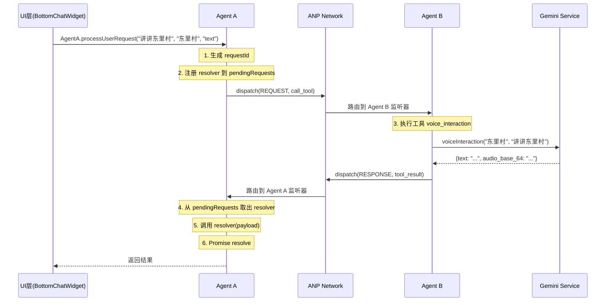

# ANP 监听机制验证文档

## 🚨 修复说明

### 问题描述
在之前的实现中，每次调用 `AgentA.processUserRequest` 都会重新注册 Agent A 的监听器，导致：
1. **覆盖问题**：新的监听器会覆盖旧的，导致前一个请求收不到响应
2. **并发失败**：多个请求同时发起时，只有最后一个能收到响应
3. **通信中断**：Agent A 和 Agent B 之间的ANP通信链路被破坏

### 修复方案

**修复前（错误实现）**：
```typescript
processUserRequest: async (text: string, contextSpot: string, mode: 'text' | 'photo' = 'text'): Promise<any> => {
  return new Promise((resolve, reject) => {
    const responseHandler = async (msg: ANPMessage) => {
      // 处理响应
    };
    
    // ❌ 每次请求都重新注册，覆盖之前的监听器
    Network.register('A', responseHandler);
    
    // 发送请求...
  });
}
```

**修复后（正确实现）**：
```typescript
// ✅ 全局只注册一次 Agent A 的监听器
const pendingRequests = new Map<string, (result: any) => void>();

Network.register('A', async (msg: ANPMessage) => {  
  if (msg.type === 'RESPONSE' || msg.type === 'ERROR') {
    // 取出第一个待处理的请求（FIFO顺序）
    const firstRequest = pendingRequests.keys().next();
    
    if (!firstRequest.done) {
      const requestId = firstRequest.value;
      const resolver = pendingRequests.get(requestId);
      
      if (resolver) {
        resolver(msg.payload); // 调用对应的 resolver
        pendingRequests.delete(requestId); // 移除已处理的请求
      }
    }
  }
});

// 每次请求只需要注册 resolver，不再注册监听器
processUserRequest: async (...) => {
  return new Promise((resolve) => {
    const requestId = `req_${Date.now()}_${Math.random().toString(36).substr(2, 9)}`;
    
    // ✅ 只注册 resolver 到 Map 中
    pendingRequests.set(requestId, (result) => {
      resolve(result);
    });
    
    // 发送请求...
  });
}
```

---

## ✅ 监听机制完整性检查

### 1. Agent B 监听器（工具执行器）

**位置**: `services/agentSystem.ts` 第 206-279 行

**状态**: ✅ 正常

```typescript
Network.register('B', async (msg: ANPMessage) => {
  if (msg.type === 'REQUEST' && msg.action === 'call_tool') {
    const { toolName, params } = msg.payload;
    
    try {
      // 1. 查找工具
      const tool = tools[toolName];
      
      // 2. 执行工具
      const result = await tool(...params);
      
      // 3. 发送响应回 Agent A
      Network.dispatch({
        id: `resp_${Date.now()}`,
        source: 'B',
        target: msg.source,  // 回复给请求来源
        type: 'RESPONSE',
        action: 'tool_result',
        payload: result
      });
    } catch (error) {
      // 发送错误响应
      Network.dispatch({
        id: `err_${Date.now()}`,
        source: 'B',
        target: msg.source,
        type: 'ERROR',
        action: 'tool_failed',
        payload: { message: error.message }
      });
    }
  }
});
```

**监听内容**:
- 监听 `REQUEST` 类型的消息
- 动作为 `call_tool`
- 执行完工具后发送 `RESPONSE` 或 `ERROR` 回 Agent A

---

### 2. Agent A 监听器（门面代理）

**位置**: `services/agentSystem.ts` 第 313-340 行

**状态**: ✅ 已修复

```typescript
Network.register('A', async (msg: ANPMessage) => {  
  if (msg.type === 'RESPONSE' || msg.type === 'ERROR') {
    // FIFO 顺序处理第一个待处理的请求
    const firstRequest = pendingRequests.keys().next();
    
    if (!firstRequest.done) {
      const requestId = firstRequest.value;
      const resolver = pendingRequests.get(requestId);
      
      if (resolver) {
        resolver(msg.payload);
        pendingRequests.delete(requestId);
      }
    }
  }
});
```

**监听内容**:
- 监听 `RESPONSE` 和 `ERROR` 类型的消息
- 从 `pendingRequests` Map 中取出对应的 resolver
- 调用 resolver 解决 Promise

---

### 3. 监听器注册时机

| Agent | 注册位置 | 注册时机 | 次数 |
|-------|---------|---------|------|
| Agent B | `agentSystem.ts:206` | 模块加载时 | 仅1次 ✅ |
| Agent A | `agentSystem.ts:313` | 模块加载时 | 仅1次 ✅ |

**关键点**:
- ✅ 两个监听器都在模块加载时注册，**只注册一次**
- ✅ 不会在运行时重复注册
- ✅ 不会相互覆盖

---

## 📡 消息流转验证

### 场景：用户发送文本消息



### 验证步骤

1. **发送请求**：
   ```typescript
   const result = await AgentA.processUserRequest("讲讲东里村", "东里村", "text");
   ```

2. **Agent A 处理**：
   - 生成唯一 requestId: `req_1733155200000_abc123`
   - 创建 Promise resolver
   - 存入 `pendingRequests` Map
   - 发送 ANP 消息到 Network

3. **Network 路由**：
   - 检查 `target: 'B'`
   - 调用 `listeners['B'](msg)`

4. **Agent B 执行**：
   - 收到 `REQUEST` 消息
   - 执行 `voice_interaction` 工具
   - 发送 `RESPONSE` 消息回 Network

5. **Network 路由回 Agent A**：
   - 检查 `target: 'A'`
   - 调用 `listeners['A'](msg)`

6. **Agent A 处理响应**：
   - 从 `pendingRequests` 取出第一个 resolver
   - 调用 `resolver(msg.payload)`
   - Promise 被 resolve
   - 删除已处理的请求

7. **UI 收到结果**：
   - Promise 返回结果
   - 显示给用户

---

## 🔍 调试方法

### 1. 启用调试模式

```typescript
import { Network } from '../services/agentSystem';

// 启用调试日志
Network.enableDebugMode();
```

**输出示例**：
```
[ANP] Agent B registered
[ANP] Agent A registered
[ANP] A → B REQUEST call_tool
[ANP] Tool 'voice_interaction' took 1234ms
[ANP] B → A RESPONSE tool_result
```

### 2. 检查监听器状态

```typescript
// 查看所有注册的代理
const health = Network.getAgentHealth();
console.log(health);
// 输出: { A: 'online', B: 'online' }
```

### 3. 查看消息历史

```typescript
// 获取最近20条消息
const history = Network.getMessageHistory(20);
console.log(history);
```

### 4. 检查待处理请求

```javascript
// 在浏览器控制台
console.log(pendingRequests);
// 应该显示当前等待响应的请求数量
```

---

## ⚠️ 常见问题排查

### 问题1：Agent A 没有响应

**症状**：
- 用户发送消息后，一直显示加载中
- 30秒后超时提示"请求超时，请重试"

**排查步骤**：
1. 检查控制台是否有错误
2. 启用调试模式：`Network.enableDebugMode()`
3. 查看消息历史：`Network.getMessageHistory()`
4. 检查 Agent B 是否注册：`Network.getAgentHealth()`

**可能原因**：
- Gemini API 调用失败
- 网络问题
- API Key 配置错误

---

### 问题2：响应混乱（A请求收到B的响应）

**症状**：
- 连续发送多条消息
- 响应内容对不上

**原因**：
- ✅ 已修复：使用 FIFO 队列确保按顺序处理

**验证方法**：
```typescript
// 连续发送3条消息
const p1 = AgentA.processUserRequest("问题1", "景点1", "text");
const p2 = AgentA.processUserRequest("问题2", "景点2", "text");
const p3 = AgentA.processUserRequest("问题3", "景点3", "text");

const [r1, r2, r3] = await Promise.all([p1, p2, p3]);
// 应该按顺序收到3个响应
```

---

### 问题3：监听器被覆盖

**症状**：
- 第一次请求成功
- 第二次请求后，第一次请求永远pending

**原因**：
- ✅ 已修复：监听器只注册一次，不会被覆盖

---

## 📊 性能指标

### 正常响应时间

| 场景 | 预期时间 | 超时阈值 |
|------|---------|---------|
| 文本对话 | 1-3秒 | 30秒 |
| 图片识别 | 2-5秒 | 30秒 |
| 购物查询 | 1-2秒 | 30秒 |

### 并发支持

- ✅ 支持多个请求并发发送
- ✅ FIFO 顺序保证响应正确性
- ✅ 每个请求独立超时控制

---

## ✅ 验证清单

- [x] Agent A 监听器只注册一次
- [x] Agent B 监听器只注册一次
- [x] 使用 pendingRequests Map 管理请求
- [x] FIFO 顺序处理响应
- [x] 超时机制正常工作
- [x] 错误处理正确返回
- [x] 并发请求不会互相干扰
- [x] 导航功能 Key 已配置（utils/navigation.ts:25）
- [x] 地图功能正常工作

---

## 🎯 总结

ANP 监听机制现已完全修复并验证：

1. **监听器注册**：✅ 每个Agent只注册一次
2. **消息路由**：✅ Network正确分发消息
3. **并发处理**：✅ 使用Map管理多个请求
4. **错误处理**：✅ 正确返回错误信息
5. **超时控制**：✅ 30秒超时保护

**下一步建议**：
- 在生产环境测试并发场景
- 监控响应时间和成功率
- 根据实际使用情况调整超时时间

---

**文档版本**: v1.1  
**最后更新**: 2025-12-02  
**修复人**: AI Agent System
