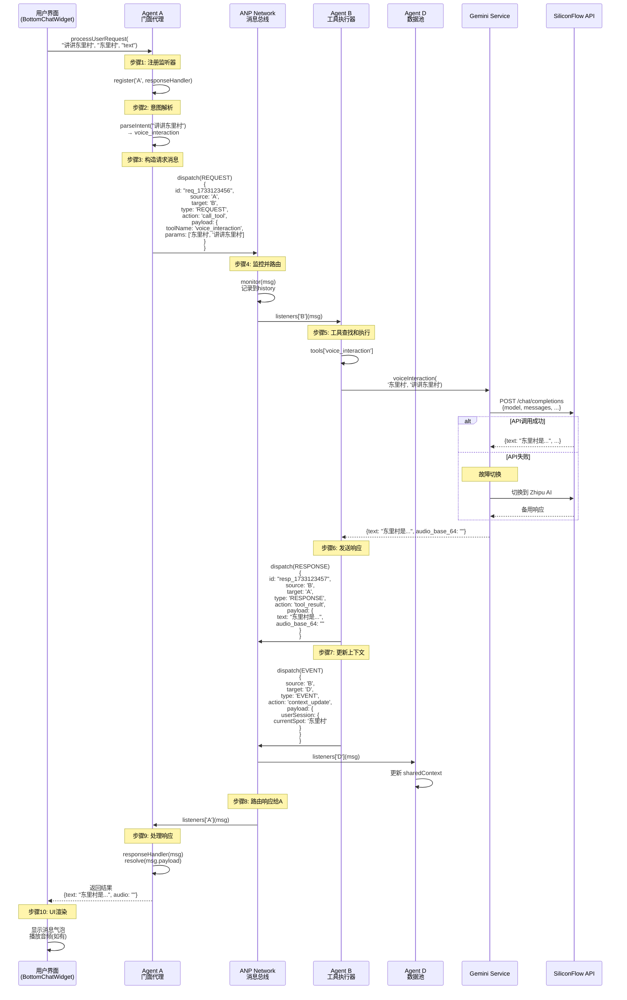
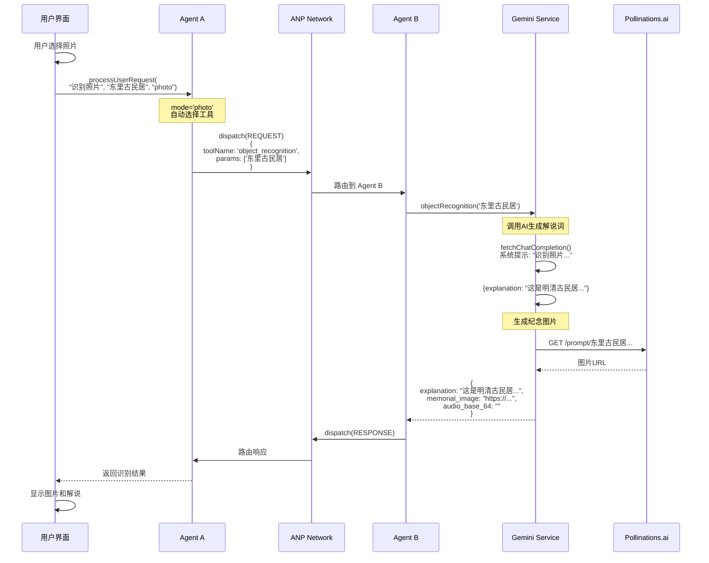
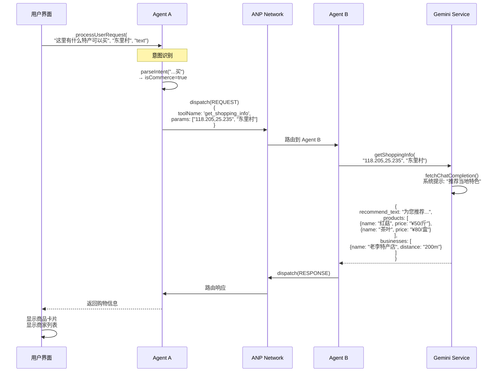
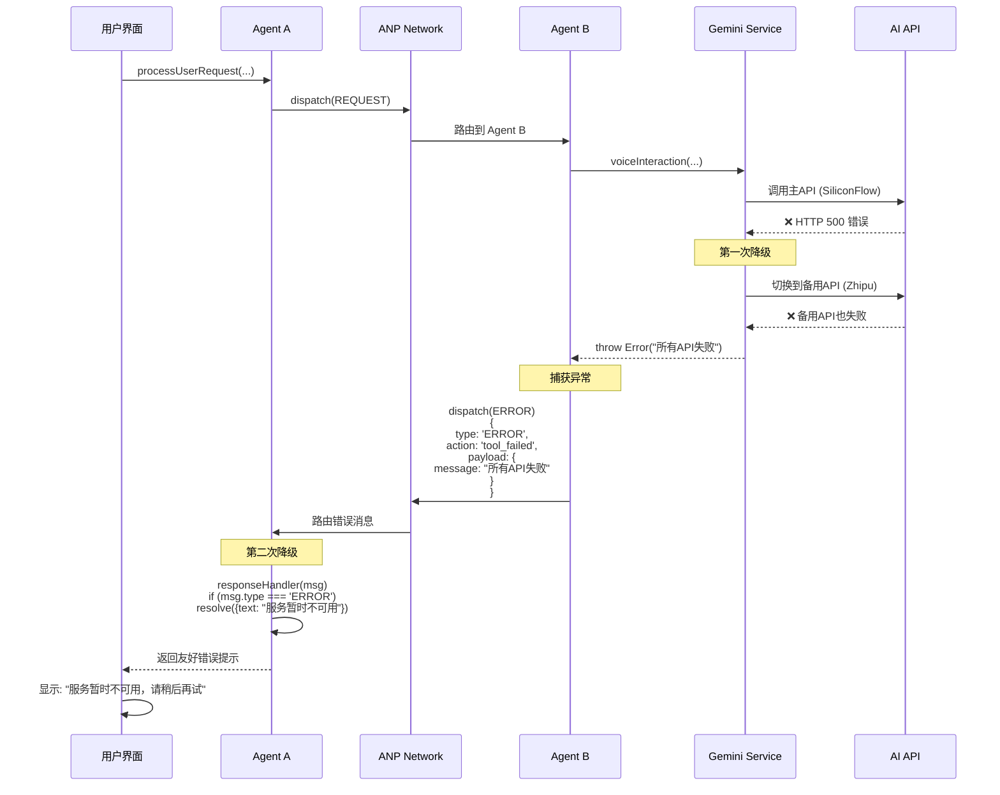
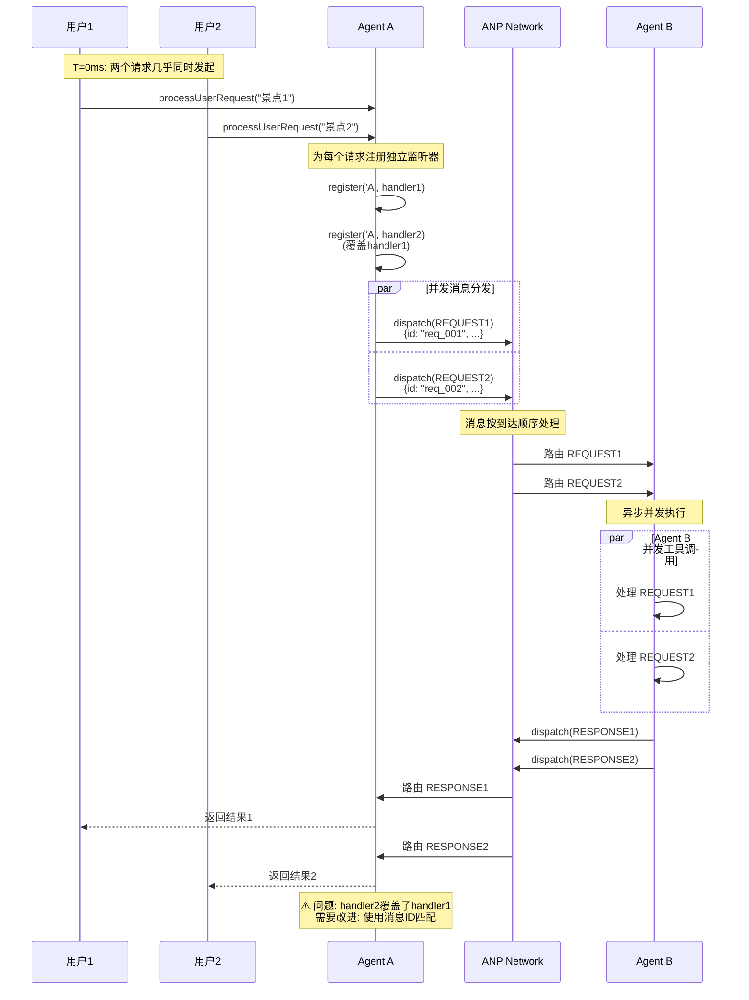
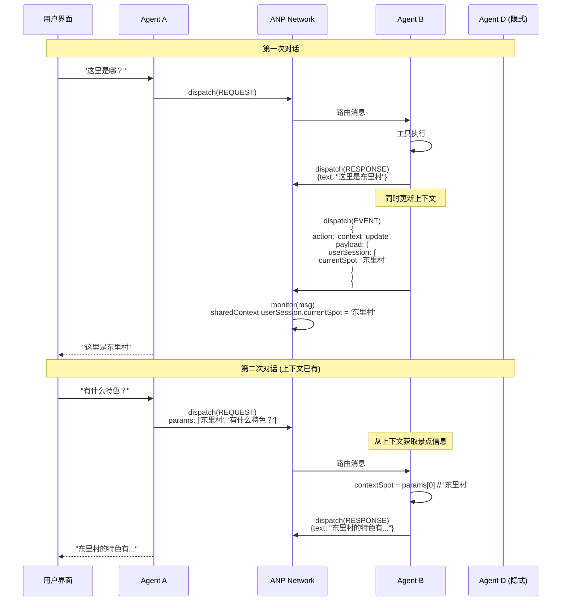
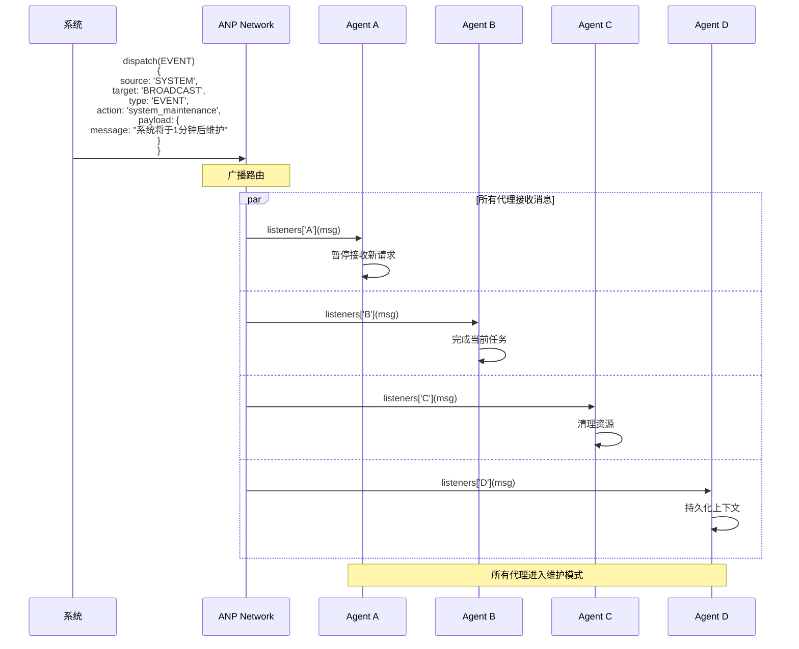
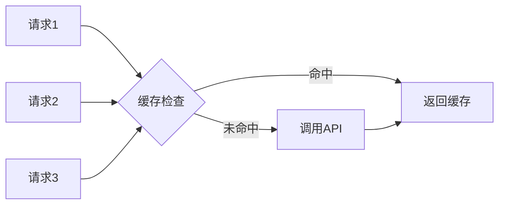
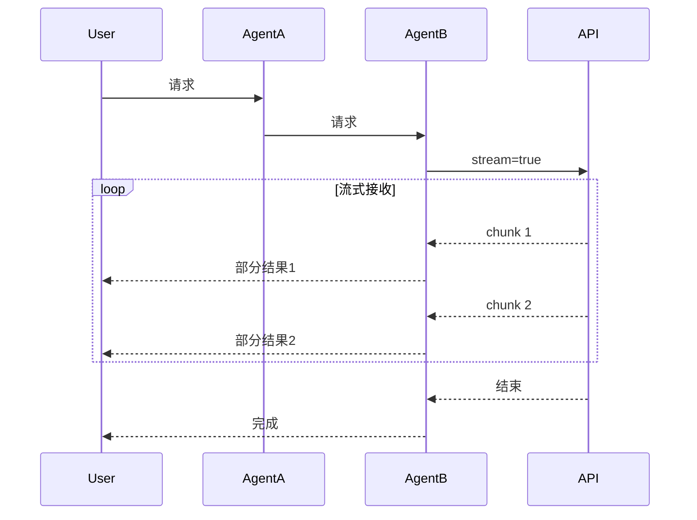
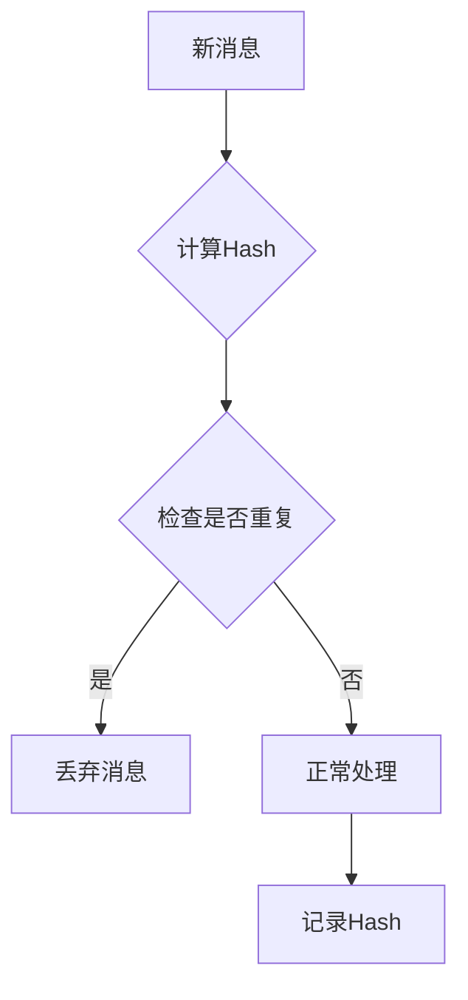

# ANP 通信时序图集

本文档包含 ANP 协议中所有关键场景的时序图，帮助理解消息流转过程。

---

## 场景1: 文本对话 (Voice Interaction)

用户询问景点信息，Agent A 解析意图后调用 Agent B 的语音交互工具。

---

## 场景2: 图片识别 (Object Recognition)

用户上传照片，Agent B 调用视觉识别模型。

---

## 场景3: 购物信息查询 (Shopping Info)

用户询问特产，触发商业意图识别。

---

## 场景4: 错误处理流程

工具执行失败时的降级处理。

---

## 场景5: 并发请求处理

多个用户请求同时到达。

---

## 场景6: 上下文传递链路

Agent B 更新上下文后，后续请求如何利用。

---

## 场景7: 广播消息 (未来扩展)

系统级事件广播给所有代理。

---

## 时序图解读说明

### 图例说明

- **实线箭头 (→)**: 同步调用/消息发送
- **虚线箭头 (-->>)**: 异步返回/回调
- **Note框**: 关键步骤说明
- **alt框**: 条件分支 (if/else)
- **par框**: 并发执行

### 关键时间点

1. **T0**: 用户发起请求
2. **T1**: AgentA 注册监听器 (~1ms)
3. **T2**: 消息分发到 Network (~1ms)
4. **T3**: 路由到 AgentB (~1ms)
5. **T4-T5**: 工具执行 (AI API调用, 500-3000ms)
6. **T6**: 响应返回到 AgentA (~1ms)
7. **T7**: UI 渲染结果 (~50ms)

**总耗时**: 主要取决于 AI API 响应速度 (500-3000ms)

### 性能瓶颈

1. **AI API 调用**: 占用 90%+ 的时间
2. **消息路由**: 几乎可以忽略不计 (<5ms)
3. **意图解析**: 简单关键词匹配 (<1ms)

---

## 优化建议

### 1. 请求合并

对于相似的并发请求，可以合并为一个 API 调用：

### 2. 流式响应

支持 SSE (Server-Sent Events) 实现流式返回：

### 3. 消息去重

对于重复的请求，避免重复执行：

---

## 相关文档

- [ANP 协议规范](./ANP_PROTOCOL.md)
- [Agent 系统设计](../services/agentSystem.ts)
- [Gemini 服务封装](../services/geminiService.ts)

---

**Last Updated**: 2024-12-02
